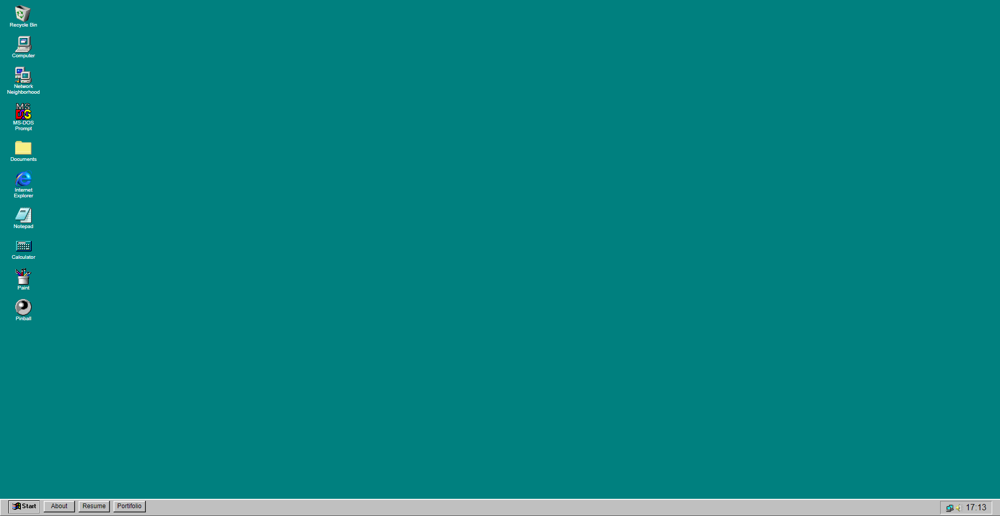
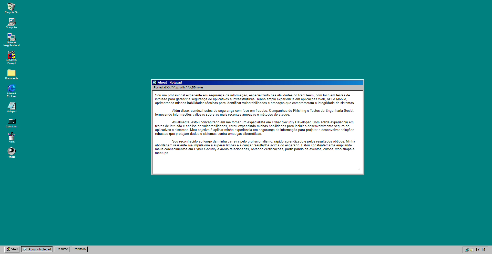

# My-Portfolio 

Este é o meu projeto de portfólio com tema do Windows 98, inspirado na interface clássica do sistema operacional da Microsoft.

Você pode visualizar o portfólio em funcionamento [aqui](https://t4rum.github.io/my-portfolio/).

## Visão Geral

O projeto utiliza HTML, CSS e JavaScript para criar uma experiência nostálgica, relembrando elementos familiares do Windows 98, como a barra de tarefas e ícones de aplicativos.

## Conteúdos em Construção 

- **Sobre - Notepad:** Página com informações sobre mim, apresentada em um estilo semelhante ao bloco de notas do Windows 98.
- **Resume:** Página contendo meu currículo.
- **Portfólio:** Seção destacando meus projetos e trabalhos.

## Imagens

  
   

